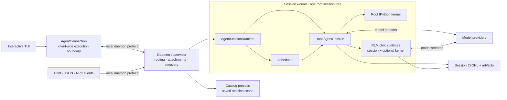
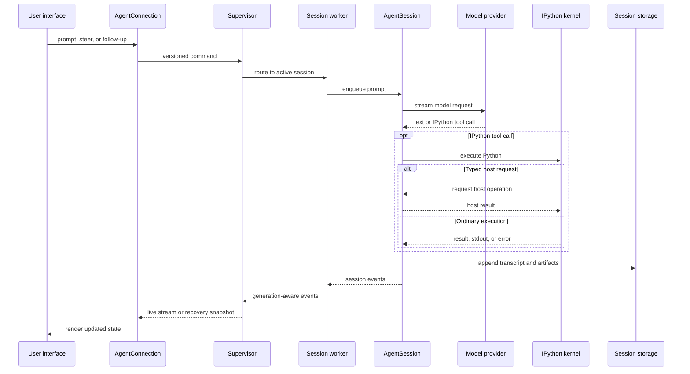

# Architecture Overview

Prime Agent separates terminal presentation, process coordination, agent execution, model-facing Python, and persisted state. Normal interactive sessions use the daemon-backed path below; explicit SDK and fallback integrations can run the same `AgentSessionRuntime` in process.

## System at a Glance

- The client owns rendering, keyboard input, and local UI preferences; it does not own execution.
- The supervisor owns discovery, routing, attachments, worker health, and cross-agent message delivery.
- Each worker owns one root runtime, its scheduler, kernels, and all descendants below that root.
- `AgentSession` owns provider calls, queues, tools, compaction, goals, child lifecycles, and transcript writes.
- IPython is the model-facing control environment. Typed host requests return authoritative operations to the TypeScript session.

Workers and kernels are separate processes for lifecycle and failure containment, not security sandboxes. They normally run with the same operating-system permissions as the client.

## Prompt Execution Flow

From the session queue onward, the same execution and persistence path is used when a prompt comes from a heartbeat, cron schedule, goal continuation, autonomous mode, or another agent instead of an attached user.

## Detailed Architecture

- [Agent Connection Architecture](agent-connection.md) explains the client/runtime boundary, snapshots, replay, and reconnect behavior.
- [Daemon Architecture](daemon.md) covers process ownership, leases, scheduling, backpressure, and crash recovery.
- [RLM Runtime Architecture](rlm-runtime.md) follows IPython host requests and recursive child execution.
- [Long-Running and Background Agents](long-running-agents.md) shows how detached sessions, messages, goals, and scheduled work share the worker runtime.
