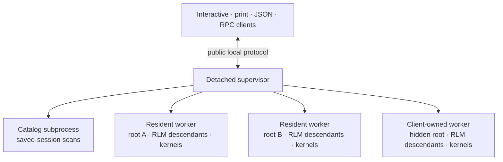

# Daemon Architecture

Prime Agent isolates each active root session tree in its own process. The daemon is internal infrastructure: interactive, print, JSON, RPC, piped-stdin, and `--no-session` describe client behavior and retain their public I/O contracts.

## Process Topology



The supervisor owns public sockets, client attachments, routing, global agent-message delivery, worker health, command journals, and coordinated updates. It does not execute providers, tools, compaction, bash, kernels, schedules, or transcript scans.

The catalog subprocess owns saved-session scans and inactive-session file operations. A catalog failure can fail a catalog request without interrupting active workers.

Each worker owns one root `AgentSessionRuntime`, its root `AgentSession`, scheduler, kernels, and every RLM descendant below that root. New, switch, fork, and import operations replace the root runtime inside the worker while preserving the public active-session ID.

## Resident Workers

Normal interactive sessions use resident workers:

- The supervisor starts one detached process group per active root tree.
- Closing the TUI detaches the client; it does not stop the worker.
- Worker descriptors, authentication tokens, active-session IDs, session paths, and recovery journals are written with owner-only permissions under the agent directory.
- Workers monitor the public supervisor socket. If it disappears, one worker acquires an atomic launch lease and starts a replacement supervisor.
- A replacement supervisor adopts live workers and their active-session IDs.
- A worker crash affects one root tree. Recovery retries after 250 ms, 1 second, and 5 seconds; three failures mark that root failed.
- `prime-agent shutdown` stops the supervisor and all workers; `--force` also terminates unresponsive worker process groups and tracked children.

There is no fixed session, worker, client, or workload cap in this layer.

## Client-Owned Workers

Headless and ephemeral clients use the same worker runtime as interactive clients but give the worker a client-owned lifecycle:

- print, piped stdin, and JSON mode remain one-shot;
- RPC keeps LF-delimited JSONL framing and accepts prompts until EOF;
- interactive `--no-session` uses an in-memory session;
- normal completion explicitly removes the worker without archiving it;
- unexpected client loss starts a bounded cleanup grace period;
- reconnect with the same stable client identity cancels cleanup; and
- default lists, global schedules, and peer routing omit client-owned workers unless the owner explicitly addresses them.

The full launch environment remains in supervisor memory and is not written to the worker descriptor. Direct SDK calls to print and RPC modes remain in-process so embedders can pass non-serializable extension factories.

## Session Ownership and Leases

Every persisted session is protected by a process-safe lease keyed by canonical JSONL path.

- A worker acquires a target lease before opening a session.
- Runtime replacement acquires the new lease before releasing the old one.
- Concurrent opens return `session_already_active` with the owning active-session ID.
- Concurrent creates for the same path converge on one worker launch.

This prevents daemon workers and one-shot clients from writing the same transcript concurrently.

## Scheduling

Each worker runs one scheduler for its root and descendants. Jobs are persisted per session in `session-artifacts/<session-id>/scheduled-jobs.json`; workers do not share a global cron file.

Due ticks are claimed and advanced before prompt delivery. A crash therefore does not replay an uncertain prompt. Different target sessions dispatch independently, and a still-active claim coalesces later missed ticks instead of building an unbounded backlog.

Resident workers keep scheduling across supervisor replacement. Worker recovery marks uncertain claims interrupted, keeps the advanced schedule, and resumes future ticks only. The supervisor routes schedule commands and merges worker summaries for global listing.

## Public Daemon Protocol v4

The public local socket is JSONL-framed. The current protocol provides:

- versioned command envelopes with stable client and command IDs;
- capability negotiation and per-command compatibility metadata;
- generation-aware event cursors `{ generation, sequence }`;
- reconnect with a stable identity and resume cursor;
- attach acknowledgment plus coherent snapshots;
- begin/chunk/end snapshot streaming with a 512 KiB target chunk size;
- file-backed transcript caches above 4 MiB;
- resident and client-owned worker lifecycle commands;
- daemon-side headless completion, session-header, bash, and retry operations; and
- structured errors for recoverable cases such as an already-active session or uncertain mutation result.

Protocol version and schema revision are independent. A compatible addition can be capability-gated or require a schema revision; an incompatible wire change requires a protocol bump.

Protocol v1 is retained only for the one-release update handoff that prepares and stops an older daemon. A busy older daemon that cannot produce a recovery manifest is left running.

JSON and RPC client modes do not expose daemon greetings, envelopes, snapshot records, lifecycle events, or connection metadata.

## Reconnect, Replay, and Snapshots

Every sequenced event belongs to a worker generation. Clients retain the last `{ generation, sequence }` cursor and present it on attach. The server reports whether the requested interval is complete, partial, or unavailable.

A generation change invalidates comparison with the old sequence. Missing replay is not fatal: the attach snapshot is the durable recovery baseline. `DaemonAgentConnection` applies the snapshot, ignores duplicate or retired-generation events, and reports a resynchronized session to the UI.

Large snapshots are encoded in the worker and streamed as opaque chunks through a bounded supervisor cache. The supervisor never constructs a history-sized object.

## Private Worker Transport

Supervisor-worker traffic uses a binary frame:

```text
4-byte JSON header length
4-byte payload length
small JSON routing header
opaque payload bytes
```

Workers serialize a public event once. The supervisor reads only the routing header and forwards the same payload buffer to eligible clients.

Assistant streaming uses compact start/delta/end payloads privately. The supervisor reconstructs the existing public `message_update` once per delta, so the full growing assistant message is not repeatedly transferred from worker to supervisor.

Private worker connections authenticate with per-worker tokens and are fenced to the current supervisor generation. This prevents an obsolete replacement supervisor from continuing to command an adopted worker. It is process coordination, not a sandbox boundary: all processes still run as the same OS user.

## Backpressure

Backpressure is attachment-local:

- a blocked client stops receiving incremental events;
- other clients and workers continue;
- the supervisor retains no unbounded per-client queue; and
- after drain, the attachment catches up from its cursor or receives a fresh snapshot.

Final transcript caching is separate from live partial-message reconstruction.

## Idempotency and Crash Recovery

Mutating commands are keyed by `clientId + commandId` and recorded before dispatch in an append-only journal.

- Repeating a completed command returns the stored result.
- A received command without a durable result is reported as uncertain and is not replayed.
- Reconnect retains the same command ID.
- Clients acknowledge completed mutations so journal entries can be compacted.

Workers journal operation transitions and detached subprocess identities. After a worker crash, recovery reaps its old process group and tracked detached bash trees, appends a visible recovery marker to the transcript, restores the root under the same active-session ID, and does not replay uncertain side effects.

## Coordinated Updates

Update preparation is two-phase:

1. Resident workers create non-destructive checkpoints in parallel.
2. The supervisor validates and atomically persists the aggregate manifest.
3. Only after every prepare succeeds does it commit and stop workers.

If preparation or manifest validation fails, prepared workers are released and all roots continue running.

## Benchmarks

From `packages/coding-agent`:

```sh
npx tsx test/daemon-multiclient-bench.ts
npx tsx test/daemon-multiclient-bench.ts --generated-session-mib 100
npx tsx test/daemon-multiclient-bench.ts --generated-session-mib 500
npx tsx test/daemon-multiclient-bench.ts --session-file /path/to/session.jsonl
PRIME_AGENT_STRESS_WORKERS=50 npx tsx ../../node_modules/vitest/dist/cli.js --run test/daemon-supervisor-process.test.ts -t "hosts resident roots"
```

The benchmark compares fanout and attach paths, including serialization count, throughput, elapsed time, and sampled RSS. The stress case starts many resident roots and verifies that their schedules advance independently while sessions are busy.
